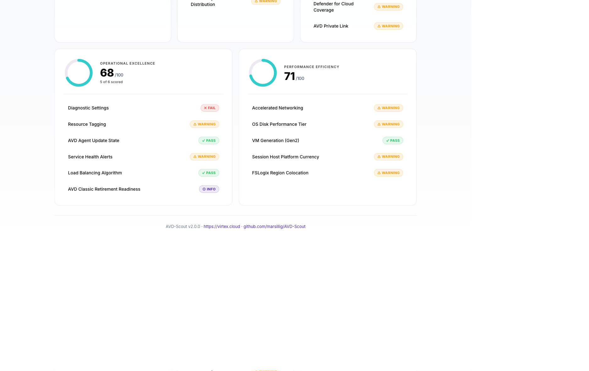

# AVD-Assess

**A free, open-source PowerShell health checker for Azure Virtual Desktop.** Connects to your subscription, runs 25 best-practice checks across all five [Well-Architected Framework pillars for AVD](https://learn.microsoft.com/azure/well-architected/azure-virtual-desktop/) — Cost, Reliability, Security, Operations, and Performance Efficiency — and produces a self-contained HTML report with traffic-light scoring and remediation guidance.

## Why this exists

There is no free, open-source, automated health checker for AVD. Microsoft's Well-Architected Framework for AVD is thorough documentation, but operationalising it means either paying for a commercial tool, running a manual review, or doing nothing. AVD-Assess turns the guidance into a five-minute script that produces a shareable report — covering all five WAF pillars and every finding linked to a specific Microsoft Learn article.



## What it checks

**Cost Optimisation** — scaling plan coverage on pooled host pools; Start VM on Connect across both personal and pooled pools (scaling-plan-aware scoring); unhealthy hosts still in session rotation; max session limit configuration.

**Reliability & Resilience** — session host health; RDP Shortpath / network auto-detect configuration; agent update ring split (validation vs production); session capacity headroom; FSLogix profile redundancy (zone-redundant storage SKU); availability zone distribution across multi-host pooled pools.

**Security Posture** — drive redirection policy; clipboard redirection review; Trusted Launch / Secure Boot; Entra ID join status (with hybrid vs cloud-only FSLogix support matrix); Microsoft Defender for Cloud coverage (Servers + Storage plans); AVD Private Link / public network access on host pools.

**Operational Excellence** — diagnostic settings sending to a Log Analytics workspace; resource tagging (Environment, Owner); AVD agent update state; Azure Service Health alerts covering AVD; load balancing algorithm review.

**Performance Efficiency** — Accelerated Networking on session host NICs; OS disk performance tier (Premium SSD or better on multi-session hosts); VM generation (Gen2); FSLogix region colocation between host pool and profile storage.

Every finding names the affected resources, explains the fix in concrete terms, and links to the relevant Microsoft Learn article.

## Prerequisites

- **PowerShell 7+** — [download from Microsoft](https://learn.microsoft.com/powershell/scripting/install/installing-powershell)
- **Az PowerShell modules** — `Az.Accounts`, `Az.DesktopVirtualization`, `Az.Compute`, `Az.Monitor`, `Az.Resources`, `Az.Network`, `Az.Storage`, `Az.Security`
- **Azure permissions** — `Reader` on the subscription covers most checks. Two checks need additional scope:
  - **Defender for Cloud coverage** — `Microsoft.Security/pricings/read` (granted by *Security Reader*)
  - **Service Health alerts** — `Microsoft.Insights/activityLogAlerts/read` (granted by *Monitoring Reader*)
  
  Both are read-only and additive — checks degrade to `Info` rather than failing if missing.

## Quick start

```powershell
# Install required modules (one-time)
Install-Module Az.Accounts, Az.DesktopVirtualization, Az.Compute, Az.Monitor, Az.Resources, Az.Network, Az.Storage, Az.Security -Scope CurrentUser

# Clone the repo
git clone https://github.com/waynebellows/AVD-Assess.git
cd AVD-Assess

# Run against your current Azure context
./AVD-Assess.ps1 -OpenReport
```

The script signs you in (unless `-UseExistingConnection` is used), collects AVD data, runs all 25 checks, and writes `AVD-Assess-Report-<timestamp>.html` to the current directory.

## Running from Azure Cloud Shell

AVD-Assess works in [Azure Cloud Shell](https://shell.azure.com) (PowerShell mode) — no local install, and you're already signed in to your tenant.

```powershell
# 1. Install the modules Cloud Shell doesn't ship by default
Install-Module Az.DesktopVirtualization, Az.Security -Scope CurrentUser -Force

# 2. Download the script into your persistent Cloud Drive
curl -o ~/clouddrive/AVD-Assess.ps1 https://raw.githubusercontent.com/waynebellows/AVD-Assess/main/AVD-Assess.ps1

# 3. Run it against your current Cloud Shell context
~/clouddrive/AVD-Assess.ps1 -UseExistingConnection -OutputPath ~/clouddrive/avd-assess.html
```

Then use **Manage files &rarr; Download** in the Cloud Shell toolbar to grab `avd-assess.html` and open it locally.

**Notes:**
- Use `-UseExistingConnection` — Cloud Shell is already authenticated.
- Omit `-OpenReport` — there's no browser inside Cloud Shell.
- Writing to `~/clouddrive` keeps the report across sessions.

## Parameters

| Parameter | Description | Example |
|---|---|---|
| `-SubscriptionId` | Azure subscription ID to assess. Falls back to the current Az context. | `00000000-0000-0000-0000-000000000000` |
| `-TenantId` | Azure tenant ID. Falls back to the current Az context. | `11111111-1111-1111-1111-111111111111` |
| `-OutputPath` | Path for the HTML report. Defaults to the current directory with a timestamp. | `C:\Reports\avd.html` |
| `-HostPoolName` | Scope the assessment to a single host pool (requires `-ResourceGroupName`). | `hp-prod-pooled-01` |
| `-ResourceGroupName` | Scope the assessment to a specific resource group. | `rg-avd-prod` |
| `-UseExistingConnection` | Skip `Connect-AzAccount` and use the existing Az context. Useful for automation. | *switch* |
| `-OpenReport` | Open the HTML report in the default browser when complete. | *switch* |
| `-DryRun` | Render the report with synthetic data — no Azure calls. Useful for UI verification and contributors testing changes. | *switch* |
| `-FSLogixStorageAccount` | Name of the FSLogix profile storage account, applied to every host pool in scope. Overrides tag and pattern discovery. | `stfslogixprod` |
| `-FSLogixTagName` | Host pool tag whose value names the FSLogix storage account. Defaults to `FSLogixStorageAccount`. | `ProfileStorage` |
| `-FSLogixNamePattern` | Wildcard pattern used to identify FSLogix storage accounts by name. Defaults to `*fslogix*`. Set to empty string to disable name-pattern discovery. | `*profiles*` |

### FSLogix storage discovery

The FSLogix Region Colocation and Profile Redundancy checks need to know which storage account hosts your profile containers. Discovery is three-stage, in this order:

1. **`-FSLogixStorageAccount`** — explicit parameter, applies to every host pool. Best for one-off runs.
2. **Host pool tag** (default name `FSLogixStorageAccount`) — durable; recommended for ongoing use. AVD-Assess proposes this as a community convention; no Microsoft-blessed standard exists.
3. **Name-pattern scan** in the host pool's resource group (default `*fslogix*`).

If none match, both FSLogix checks return `Info`. The finding text records which method matched so you can tell whether the result was auto-detected or supplied.

## Examples

```powershell
# Full subscription, open the report when done
./AVD-Assess.ps1 -SubscriptionId "00000000-0000-0000-0000-000000000000" -OpenReport

# Single host pool
./AVD-Assess.ps1 -HostPoolName "hp-prod-pooled-01" -ResourceGroupName "rg-avd-prod"

# Automation-friendly (already authenticated)
./AVD-Assess.ps1 -UseExistingConnection -OutputPath "C:\Reports\avd-health.html"

# Verify the report layout without hitting Azure (synthetic data)
./AVD-Assess.ps1 -DryRun -OpenReport

# FSLogix storage isn't tagged or name-matched - override for this run
./AVD-Assess.ps1 -UseExistingConnection -OpenReport -FSLogixStorageAccount stfslogixprod
```

## How the scoring works

Each check returns a status and a 0–100 score:

- **Pass** (green) — meets best practice. Score 100.
- **Warning** (amber) — partial gap or non-critical issue. Score 40–80.
- **Fail** (red) — significant cost, reliability, or security risk. Score 0–40.
- **Info** (teal) — couldn't be evaluated (e.g. missing data, permissions, or check not applicable to the environment). Excluded from category averages.

**Category score** = average of non-Info checks in that category. **Overall score** = average of the category scores.

Two presentation rules keep partially evaluated results honest:

- When a category has at least one Info check, the card displays `X of Y scored` beneath the donut so a passing-looking score doesn't disguise a partially evaluated category.
- When *every* check in a category is Info, the donut renders `N/A` and the category is excluded from the overall score entirely.

## Contributing

Bug reports, new checks, and report design improvements are all welcome. See [CONTRIBUTING.md](CONTRIBUTING.md) for the data model and style guidance.

## License

[MIT](LICENSE) — use, modify, and redistribute freely.

---

Built by [Wayne Bellows](https://modern-euc.com) · Feedback: wayne_bellows@hotmail.com
